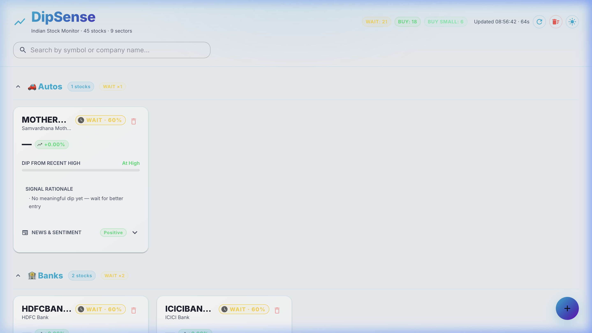
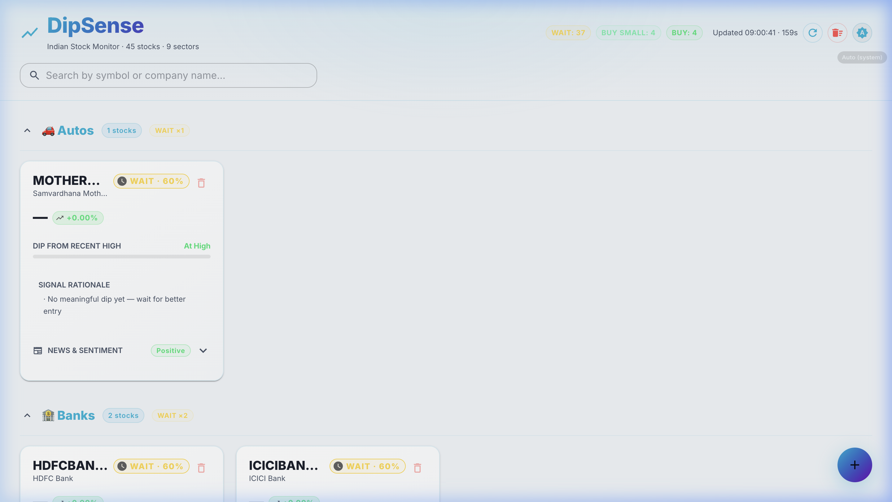
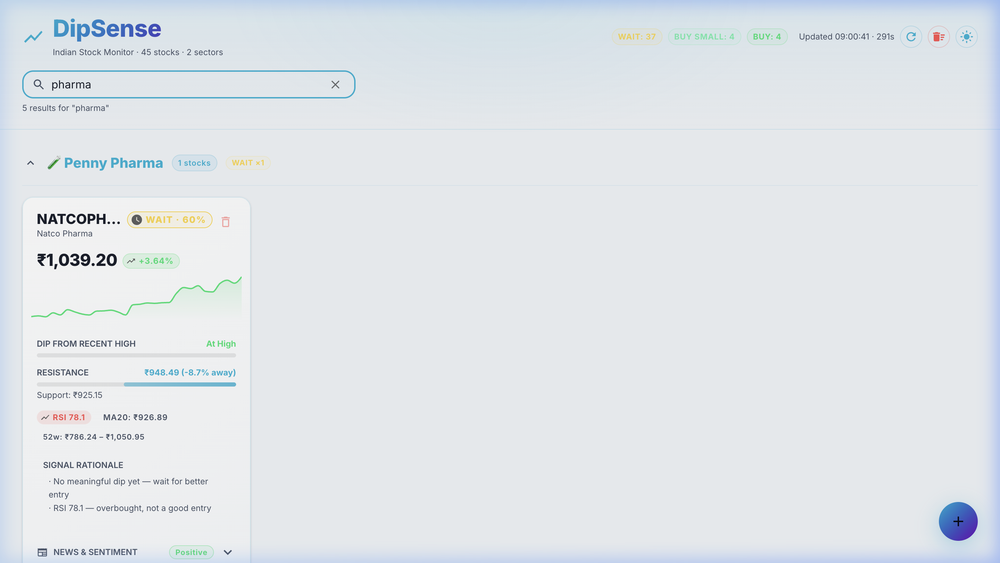
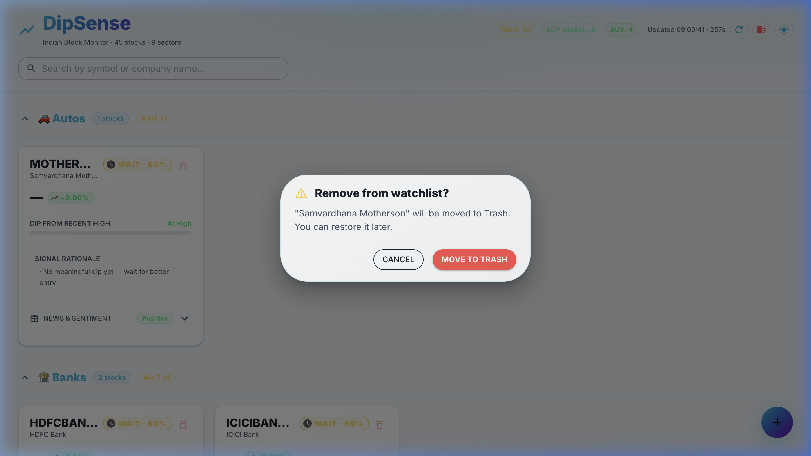
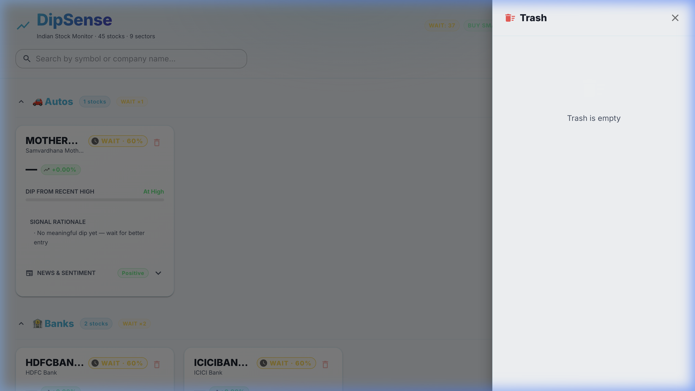

<div align="center">

# 📈 DipSense

### Indian Stock Monitor — Track dips, signals & sentiment in real time

[](https://python.org)
[](https://fastapi.tiangolo.com)
[](https://react.dev)
[](https://mui.com)
[](https://sqlite.org)

</div>

---

## 🖼️ Screenshots

### Dashboard — Dark Mode


### Dashboard — Light Mode


### Search


### Confirmation Dialog before Delete


### Trash Drawer


---

## ✨ Features

| Feature | Description |
|---------|-------------|
| 📊 **Sector Dashboard** | Stocks grouped by sector with per-sector signal summary |
| 📉 **Dip Detection** | Tracks % drop from recent high — *minor → extreme* severity |
| 📈 **Technical Signals** | BUY / BUY SMALL / WAIT / HOLD / AVOID based on RSI, MA, dip, news |
| 💹 **Sparklines** | 30-day mini price chart per card |
| 📰 **News Sentiment** | Recent headlines + negative sentiment score |
| 🗑️ **Soft Delete & Trash** | Delete stocks safely — restore them later or purge permanently |
| ⚠️ **Confirmation Dialogs** | Every destructive action asks for confirmation first |
| 🔔 **Toast Notifications** | Bottom-right toasts for every add/delete/restore/error |
| 🔍 **Search** | Real-time filter by ticker symbol or company name |
| ▲▼ **Collapsible Sectors** | Collapse sector groups — state persists across refreshes |
| 🌗 **Theme Switcher** | Dark / Light / Auto (follows OS) — persists in localStorage |
| ⚙️ **Settings UI** | DB-backed config drawer — edit negative keywords, dip thresholds, RSI levels, history period, and more |
| 🗄️ **DB-Driven Watchlist** | Everything in SQLite — no JSON files |

---

## 🏗️ Architecture

```
┌──────────────────────────────┐      HTTP/REST       ┌──────────────────────────────┐
│  React + Vite  (port 5173)   │ ◄──────────────────► │  FastAPI      (port 8000)    │
│                              │                       │                              │
│  Dashboard · StockCard       │                       │  /api/stocks  (CRUD)         │
│  TrashPage · ConfirmDialog   │                       │  /api/dashboard              │
│  ThemeContext · notistack    │                       │  /api/scheduler/refresh/:sym │
└──────────────────────────────┘                       └────────────┬─────────────────┘
                                                                    │
                                                          ┌─────────┴─────────┐
                                                          │   SQLite DB        │
                                                          │  watchlist table   │
                                                          │  stock_cache table │
                                                          └─────────┬─────────┘
                                                                    │ on manual refresh
                                                          ┌─────────┴──────────┐
                                                          │  yfinance + news    │
                                                          │  → analysis.py      │
                                                          │  → store.upsert()  │
                                                          └────────────────────┘
```

> Full architecture with Mermaid diagrams, DB schema, and data flow: **[docs/architecture.md](docs/architecture.md)**

---

## 🚀 Getting Started

### Prerequisites

- Python 3.10+
- Node.js 18+

### 1. Clone & install backend

```bash
git clone https://github.com/yourname/stockMonitor.git
cd stockMonitor/backend

python3 -m venv venv
source venv/bin/activate          # Windows: venv\Scripts\activate
pip install -r requirements.txt
```

### 2. Seed the database

Migrate the initial watchlist into SQLite (run once):

```bash
python seed_db.py
```

Output:
```
[seed] Done!
  ✅ Inserted : 45 stocks (2 as soft-deleted)
  ⏭  Skipped  : 0 (already in DB)
```

### 3. Install frontend

```bash
cd ../frontend
npm install
```

### 4. Start both servers

```bash
# From the project root:
bash start_backend.sh    # FastAPI on :8000
bash start_frontend.sh   # Vite on :5173
```

Then open **http://localhost:5173**

---

## 📖 How It Works

### Data Refresh
Auto-refresh is **intentionally disabled** to avoid yfinance rate limits. Data updates happen:
- When you **manually click ⟳** next to any stock (calls `POST /api/scheduler/refresh/{symbol}`)
- When you **add a new stock** (one-shot refresh fires immediately)

### Soft Delete Flow
```
Delete button → Confirmation dialog → Move to Trash (deleted_at timestamp set)
Trash drawer  → Restore button    → Back on dashboard (deleted_at cleared, refresh queued)
Trash drawer  → Delete Forever    → Permanently removed from DB
```

### Theme Persistence
Your theme choice (`dark` / `light` / `auto`) is saved to `localStorage`. `auto` reads your OS preference and updates live if you change it in system settings.

### Sector Collapse Persistence
Collapsed/expanded state per sector is stored in `localStorage` under the key `collapsedSectors`.

---

## 🗂️ Project Structure

```
stockMonitor/
├── backend/
│   ├── main.py              # All FastAPI routes
│   ├── scheduler.py         # Manual-trigger refresh engine
│   ├── seed_db.py           # One-time DB migration script
│   ├── stock_data.db        # SQLite (auto-created)
│   └── data/
│       ├── store.py         # DB read/write (watchlist + cache)
│       ├── fetcher.py       # yfinance wrappers
│       ├── analysis.py      # Dip · RSI · MA · Signal logic
│       └── news.py          # Headlines + sentiment scoring
│
├── frontend/
│   └── src/
│       ├── App.jsx                    # Theme provider root
│       ├── ThemeContext.jsx           # Dark/Light/Auto
│       ├── api.js                     # Axios API client
│       └── components/
│           ├── Dashboard.jsx          # Main page
│           ├── StockCard.jsx          # Stock card with all metrics
│           ├── AddStockModal.jsx      # Add stock dialog
│           ├── ConfirmDialog.jsx      # Reusable confirm dialog
│           ├── TrashPage.jsx          # Trash drawer
│           ├── SignalBadge.jsx        # Signal chip
│           ├── Sparkline.jsx          # Mini chart
│           └── NewsPanel.jsx         # News + sentiment
│
├── docs/
│   ├── architecture.md      # System design + Mermaid diagrams
│   ├── debugging.md         # Common issues + API reference
│   └── development.md       # How to extend the app
│
├── start_backend.sh
└── start_frontend.sh
```

---

## 🔌 API Reference

| Method | Endpoint | Description |
|--------|----------|-------------|
| `GET` | `/api/stocks` | Active watchlist |
| `POST` | `/api/stocks` | Add stock `{symbol, name, sector}` |
| `DELETE` | `/api/stocks/:symbol` | Soft-delete (move to trash) |
| `GET` | `/api/stocks/deleted` | All soft-deleted stocks |
| `POST` | `/api/stocks/:symbol/restore` | Restore from trash |
| `DELETE` | `/api/stocks/:symbol/purge` | Permanently hard-delete |
| `GET` | `/api/dashboard` | Full analysis for all active stocks |
| `GET` | `/api/analyze/:symbol` | Cached analysis for one stock |
| `GET` | `/api/scheduler/status` | Refresh state + data freshness |
| `POST` | `/api/scheduler/refresh/:symbol` | Manually refresh one stock |
| `GET` | `/health` | Health check |

**Interactive API docs (Swagger):** http://localhost:8000/docs

---

## 🛠️ Supported Tickers

| Exchange | Format | Example |
|----------|--------|---------|
| NSE (India) | `SYMBOL.NS` | `RELIANCE.NS` |
| BSE (India) | `SYMBOL.BO` | `RELIANCE.BO` |
| US Markets | `SYMBOL` | `AAPL` |

---

## 📚 Further Reading

- **[Architecture & DB Schema](docs/architecture.md)** — Mermaid diagrams, data flow, table definitions
- **[Debugging Guide](docs/debugging.md)** — Common issues, SQLite inspection, API testing
- **[Developer Guide](docs/development.md)** — Adding stocks, sectors, signals, endpoints, themes

---

## 🗒️ Changelog

### v3.0 (Current)
- ✅ Fully DB-driven watchlist (`watchlist` SQLite table)
- ✅ `seed_db.py` migration from `stocks.json`
- ✅ Soft delete + Trash page + restore + purge
- ✅ Confirmation dialogs before any destructive action
- ✅ Toast notifications (notistack)
- ✅ Dark / Light / Auto theme switcher
- ✅ Real-time search by symbol or name
- ✅ Collapsible sector groups (persistent)
- ✅ Auto-refresh disabled (manual-only, prevents rate limits)
- ✅ Text ellipsis + tooltip on long stock names

### v2.0
- SQLite caching layer replacing live scraping
- APScheduler background refresh
- Sector-grouped dashboard layout

### v1.0
- Initial live-scraping prototype
