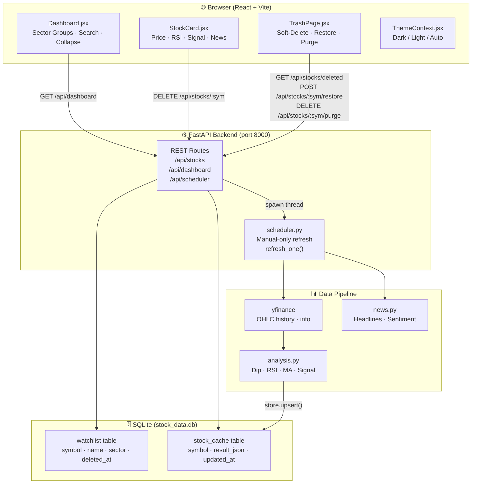

# DipSense — System Architecture

## Overview

DipSense is a full-stack Indian stock monitor with a FastAPI backend, SQLite database, APScheduler for background refreshes, and a React/Vite frontend.

---

## High-Level Architecture



---

## Data Flow

### Dashboard Load
```
Browser → GET /api/dashboard
  → store.watchlist_get_all()       # active symbols from watchlist table
  → store.get_all()                 # cached analysis from stock_cache
  → merge → return JSON
```

### Soft Delete
```
User clicks 🗑 → ConfirmDialog
  → DELETE /api/stocks/{symbol}
  → store.watchlist_soft_delete()   # sets deleted_at = now()
  → stock disappears from dashboard
  → appears in Trash drawer
```

### Restore
```
User clicks Restore in Trash
  → POST /api/stocks/{symbol}/restore
  → store.watchlist_restore()       # clears deleted_at
  → refresh_one() in background thread
  → stock reappears on dashboard
```

### Manual Refresh (per stock)
```
User clicks ⟳ on scheduler status chip
  → POST /api/scheduler/refresh/{symbol}
  → scheduler.refresh_one()
      → yfinance.download(symbol)
      → full_analysis()
      → store.upsert()
  → next GET /api/dashboard picks up new data
```

---

## Database Schema

### `watchlist` table
| Column | Type | Notes |
|--------|------|-------|
| `symbol` | TEXT PK | e.g. `RELIANCE.NS` |
| `name` | TEXT | Human-readable company name |
| `sector` | TEXT | Sector group label |
| `deleted_at` | REAL | NULL = active, unix timestamp = soft-deleted |

### `stock_cache` table
| Column | Type | Notes |
|--------|------|-------|
| `symbol` | TEXT PK | |
| `name` | TEXT | |
| `sector` | TEXT | |
| `result_json` | TEXT | Full JSON blob from `full_analysis()` |
| `updated_at` | REAL | Unix timestamp of last successful refresh |

### `app_config` table
| Column | Type | Notes |
|--------|------|-------|
| `key` | TEXT PK | e.g. `dip_threshold`, `negative_keywords` |
| `value` | TEXT | JSON-encoded (string, number, or list) |
| `type` | TEXT | `str` \| `int` \| `float` \| `json_list` |
| `label` | TEXT | Human-readable label shown in Settings UI |
| `description` | TEXT | Tooltip / helper text in Settings UI |
| `category` | TEXT | UI section (News & Sentiment, Dip Detection, Technical Analysis) |

> Default values are seeded via `INSERT OR IGNORE` on every server start — user changes are never overwritten.

---

## Directory Structure

```
stockMonitor/
├── backend/
│   ├── main.py              # FastAPI app, all REST routes
│   ├── scheduler.py         # Background refresh engine
│   ├── seed_db.py           # One-time migration from stocks.json
│   ├── stock_data.db        # SQLite database (gitignored in production)
│   ├── stocks.json          # Legacy watchlist (archived, no longer used)
│   └── data/
│       ├── store.py         # All DB read/write functions
│       ├── fetcher.py       # yfinance wrappers
│       ├── analysis.py      # Dip, RSI, MA, signals
│       └── news.py          # News + sentiment
│
├── frontend/
│   └── src/
│       ├── App.jsx                      # Root — AppThemeProvider wrapper
│       ├── ThemeContext.jsx             # Dark/Light/Auto theme + localStorage
│       ├── api.js                       # Axios API client
│       ├── main.jsx                     # React root + SnackbarProvider
│       └── components/
│           ├── Dashboard.jsx            # Main page — search, sectors, header
│           ├── StockCard.jsx            # Individual stock card
│           ├── AddStockModal.jsx        # Add stock dialog
│           ├── ConfirmDialog.jsx        # Reusable confirm dialog
│           ├── TrashPage.jsx            # Trash drawer
│           ├── SignalBadge.jsx          # BUY / WAIT / AVOID chip
│           ├── Sparkline.jsx            # Mini price chart
│           └── NewsPanel.jsx           # News headlines panel
│
├── docs/
│   ├── architecture.md      # This file
│   ├── debugging.md         # Debug guides
│   └── development.md       # How to extend the app
│
├── start_backend.sh
└── start_frontend.sh
```

---

## Technology Stack

| Layer | Technology |
|-------|-----------|
| Frontend | React 18, Vite, Material UI v6 |
| State / Toasts | React context, notistack |
| API Client | Axios |
| Backend | FastAPI (Python 3.10+) |
| Database | SQLite via stdlib `sqlite3` |
| Background jobs | APScheduler `BackgroundScheduler` |
| Market data | yfinance |
| Sentiment | Custom news scraper + scoring |
